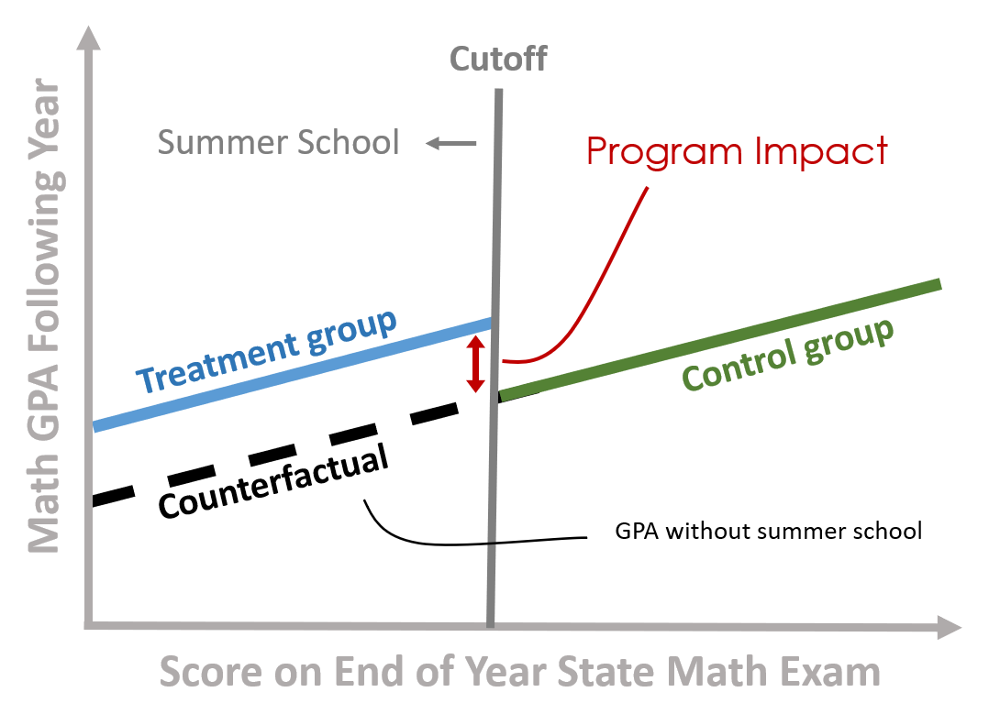

<!--- 
Submit Button - <a class="uk-button uk-button-primary" href="{{page.canvas.assignment_url}}">SUBMIT LAB</a>
-->


<div class = "uk-container uk-container-small">
  
<br><br>
<br><br>

**COURSE CONTENT:**

-----------------------

* TOC
{:toc}

-----------------------

<br>
<br>
<br>
<br>


## Review of Counterfactual Analysis

This course combines concepts from CPP 523 (Regression Analysis) and CPP 524 (Research Design) by demonstrating ways in which counterfactual reasoning can be built into regression models in order to overcome the selection and omitted variable bias problems that make it near impossible to use regular regression models to estimate program impact. 

Instead of running a basic regression with controls, the models you learn this semester use new specifications and some clevel quasi-experimental design tricks in order to create build reasonable counterfactuals into the models. When deployed properly, the resulting estimates of program impact get much closer to what a Randomized Control Trial would produce. 

The *when deployed properly* part of that statement is an important caveat - each model will be sensitive to different assumptions. We know this through a growing literature on studies that use experimental data produced by Randomized Control Trials, then re-estimate program impact with the same treatment group and a new observational control group using quasi-experimental approaches. In many contexts the quasi-experimental models produce results very close to those generated through the RCTs. 

These regression techniques represent the toolkit for causal reasoning for most evaluators. Each model will leverage of the the three counterfactual estimators discussed in CPP 524. You might find it useful to review the **Varieties of the Counterfactual** before beginning these labs and pay close attention to which estimator each model most resembles (reflexive, post-test only, or post-test with comparison). What are the assumptions necessary for each estimator to be valid? 

* [**Introduction to Counterfactuals**](https://github.com/DS4PS/cpp-524-spr-2020/raw/master/lectures/p-01-intro-to-counterfactuals.pdf)  
* [**Varieties of the Counterfactual**](https://github.com/DS4PS/cpp-524-spr-2020/raw/master/lectures/p-03-varieties-of-counterfactuals.pdf)  
* [**Testing the Counterfactual Validity**](https://github.com/DS4PS/cpp-524-spr-2020/raw/master/lectures/p-02-tests-for-cf-validity.pdf)  

<br>

**Replication Studies Using Quasi-Experimental Techniques:** 

St. Clair, T., Cook, T. D., & Hallberg, K. (2014). Examining the internal validity and statistical precision of the comparative interrupted time series design by comparison with a randomized experiment. American Journal of Evaluation, 35(3), 311-327.

Aiken, L. S., West, S. G., Schwalm, D. E., Carroll, J. L., & Hsiung, S. (1998). Comparison of a randomized and two quasi-experimental designs in a single outcome evaluation: Efficacy of a university-level remedial writing program. Evaluation Review, 22(2), 207-244.

West, S. G., Biesanz, J. C., & Pitts, S. C. (2000). Causal inference and generalization in field settings: Experimental and quasi-experimental designs.

Ferraro, P. J., & Miranda, J. J. (2017). Panel data designs and estimators as substitutes for randomized controlled trials in the evaluation of public programs. Journal of the Association of Environmental and Resource Economists, 4(1), 281-317.

<br>

**Reference:**

Cook, T. D., Scriven, M., Coryn, C. L., & Evergreen, S. D. (2010). Contemporary thinking about causation in evaluation: A dialogue with Tom Cook and Michael Scriven. American Journal of Evaluation, 31(1), 105-117. [[pdf](https://github.com/DS4PS/cpp-524-spr-2020/raw/master/pubs/conversation-with-tom-cook-and-michael-scriven.pdf)]

Gertler, P. J., Martinez, S., Premand, P., Rawlings, L. B., & Vermeersch, C. M. (2016). Impact evaluation in practice. The World Bank. [[pdf](https://openknowledge.worldbank.org/bitstream/handle/10986/25030/9781464807794.pdf?sequence=2&isAllowed=y)]
* CH3 Causal Inference and Counterfactuals  
* CH5 Regression Discontinuity Design    
* CH6 Difference in Difference Models    
* CH7 Matching    

<br>
<br>
<br>
<br>
<br>
<br>


## Week 1 - Interrupted Time Series 

<hr>

<a class="uk-button uk-button-default" style="width:130px" href="https://ds4ps.org/pe4ps-textbook/docs/p-020-time-series.html">LECTURE</a>
<br><br>
<a class="uk-button uk-button-default" style="width:130px" href="https://ds4ps.org/pe4ps-textbook/labs/time-series-lab.html">LAB</a>

**Due {{page.labs.lab-01}}**

<a class="uk-button uk-button-primary" href="{{page.canvas.assignment_url}}">SUBMIT LAB</a>
 
<hr>

**Resources:**

Bernal, J. L., Cummins, S., & Gasparrini, A. (2017). Interrupted time series regression for the evaluation of public health interventions: a tutorial. International journal of epidemiology, 46(1), 348-355. [[PDF](http://www.ag-myresearch.com/uploads/1/3/8/6/13864925/2016_lopezbernal_ije.pdf)]

Chapter on Interrrupted Time Series [[PDF](https://github.com/DS4PS/cpp-525-spr-2020/raw/master/pubs/cook-campbell-shadish-interrupted-time-series.pdf)]:  From Shadish, W. R., Cook, T. D., & Campbell, D. T. (2002). *Experimental and quasi-experimental designs for generalized causal inference.* Boston: Houghton Mifflin.

<br>

{:width="50%"}

```r
Y = b0 + (b1)(T) + (b2)(D) + (b3)(P) + e

# Interrupted Time Series Model 
# b1 = pre-intervention trend 
# b2 = discrete change after intervention 
# b3 = sustained change to the slope after intervention

# Where:
# T = time count variable 
# D = treatment dummy, 0 before , 1 after 
# P = time since intervention count
```

<br>

{:width="50%"}


<br>
<br>
<br>
<br>
<br>
<br>


## Week 2 - Difference-in-Difference Models 

<hr>

<a class="uk-button uk-button-default" style="width:130px" href="https://ds4ps.org/pe4ps-textbook/docs/p-030-diff-in-diff.html">LECTURE</a>
<br><br>
<a class="uk-button uk-button-default" style="width:130px" href="https://ds4ps.org/pe4ps-textbook/labs/diff-in-diff-lab.html">LAB</a>
<br><br>
<a class="uk-button uk-button-default" style="width:130px" href="https://asu.zoom.us/rec/play/tMIrd7yvqDo3TNfD4gSDV_V5W425e_6s2yBNrqBcxUixASFRY1GmN7VDNuqKJy2LLzjKb6H4yI5HWMZw?continueMode=true&_x_zm_rtaid=a3eEFLG8Qtiy1qBhz5Gnyg.1586645508130.02d1fbabc21b564365fde85fb34937b4&_x_zm_rhtaid=598">VIDEO</a>

---

**Due {{page.labs.lab-02}}**

<a class="uk-button uk-button-primary" href="{{page.canvas.assignment_url}}">SUBMIT LAB</a>

---

**Review:** 

Hypothesis testing with dummy variables: [lecture notes](https://github.com/DS4PS/cpp-523-spr-2020/raw/master/lectures/hypotheses-tests-with-dummy-variables.pdf)   

Varieties of the counterfactual: [lecture notes](https://github.com/DS4PS/cpp-524-spr-2020/raw/master/lectures/p-03-varieties-of-counterfactuals.pdf)   

**Reference:**

Gertler, P. J., Martinez, S., Premand, P., Rawlings, L. B., & Vermeersch, C. M. (2016). Impact evaluation in practice. The World Bank. CH-07 Difference-in-Differences [[link](https://openknowledge.worldbank.org/handle/10986/25030)]

Wing, C., Simon, K., & Bello-Gomez, R. A. (2018). Designing difference in difference studies: best practices for public health policy research. Annual review of public health, 39. [[pdf](https://www.annualreviews.org/doi/pdf/10.1146/annurev-publhealth-040617-013507)] 


<br>
<br>
<br>
<br>
<br>
<br>


## Week 3 - Panel Data with Fixed Effects 

<hr>

<a class="uk-button uk-button-default" style="width:130px" href="https://ds4ps.org/pe4ps-textbook/docs/p-040-fixed-effects.html">LECTURE</a>

<a class="uk-button uk-button-default" style="width:130px" href="https://github.com/DS4PS/cpp-525-spr-2020/raw/master/lectures/p-23-fixed-effects.pdf">NOTES</a>

<a class="uk-button uk-button-default" style="width:130px" href="https://ds4ps.org/pe4ps-textbook/labs/fixed-effects-lab.html">LAB</a>
<br><br>
<a class="uk-button uk-button-default" style="width:130px" href="https://asu.zoom.us/rec/play/vZQrcbj9qTo3T9aSuQSDC6dxW9S7Kais0SVP-qUKykm9B3QGMFahYeMVZLENnE0QqLfC7HHfx_JInrRR?continueMode=true&_x_zm_rtaid=a3eEFLG8Qtiy1qBhz5Gnyg.1586645508130.02d1fbabc21b564365fde85fb34937b4&_x_zm_rhtaid=598">VIDEO</a>


---

**Due {{page.labs.lab-03}}**

<a class="uk-button uk-button-primary" href="{{page.canvas.assignment_url}}">SUBMIT LAB</a>

---

**Reference:**

[notes on interpretting output](https://www.princeton.edu/~otorres/Panel101.pdf)

<br>

Panel models are necessary when group structure (farms A, B and C in this example) is correlated both with the level of treatment (amount of fertilizer used each season) and the outcome (some farms are more efficient). 

If it is the land causing the productivity difference and land quality varies by farm, omitting the group ID (farm fixed effect) in the model would not bias the result. But it would make the model a lot less efficient (larger standard errors).

If the management practices of the farm are driving outcomes then better managers use fertilizer more intensely, but they also do a dozen other things not captured by the model that will improve productivity. In this case the farm ID is a proxy for management, and omitting it would result in bias. 

So although group ID is measured differently than variables you have used before (it is a factor or a set of dummy variables) it operates similarly to other controls. If it is uncorrelated with the treatment then adding it will not change the policy slope, but it will make the model more efficient (explain more of the residual). If the group ID is correlated with the treatment then adding it to the model will fix bias. 


----

[random effects example](https://raw.githubusercontent.com/DS4PS/cpp-525-spr-2020/master/lectures/random-effects.R)

This example explores the relationship between mileage and used-car price. Car models (e.g. lexus, ford, and honda) are correlated with price (a lexus is more expensive on average), but they are uncorrelatd with mileage (lexus owners and honda owners are driving similar amounts each year). Car values are very different when new, but each 10,000 miles driven reduces the value by the same amount.

```r
# pooled model - all cars share same intercept
price = b0 + b1 × mileage + e

# random effects model 
price[j] = a[j] + b1 × mileage + e
```


Where the data would be structured as follows:

```r
# intercept in pooled model:
# all cars share one intercept 

      lexus |  y  1  x  | 
b0 =   ford |  y  1  x  |
      honda |  y  1  x  |

# intercept in grouped model:
# each j (car company) has its own

        lexus |  y  1  0  0  x  | 
a[j] =   ford |  y  0  1  0  x  |
        honda |  y  0  0  1  x  |
```

Group-level variable is correlated with the outcome, but uncorrelated with the policy variable. Thus omission does not cause bias, but inclusion increases efficiency allowing the model to use a separate intercept for each group and thus moving regression lines closer to the data, reducing the model error. 

*Note that this is an over-simplified presentation of the topic. The terms fixed and random effects are used differently depending on discipline (see [Gelman's insightful discussion](https://statmodeling.stat.columbia.edu/2005/01/25/why_i_dont_use/)) and the model are estimated using different technique (see [Stoudt blog, 2017](https://rlbarter.github.io/Practical-Statistics/2017/03/03/fixed-mixed-and-random-effects/)).*

---

Recall the [taxonomy of control variables](https://github.com/DS4PS/cpp-523-spr-2020/raw/master/lectures/taxonomy-of-control-variables.pdf).

* Random effects are like Type A controls  
* Fixed effects are like Type B controls  


<br>
<hr>
<br>


<br>
<br>
<br>
<br>
<br>
<br>


## Week 4 - Instrumental Variables 

<hr>

<a class="uk-button uk-button-default" style="width:200px" href="https://ds4ps.org/pe4ps-textbook/docs/p-050-instrumental-variables.html">LECTURE</a>

<a class="uk-button uk-button-default" style="width:200px" href="https://github.com/DS4PS/cpp-525-spr-2020/raw/master/lectures/p-24-instrumental-variables.pdf">LECTURE NOTES</a>

<a class="uk-button uk-button-default" style="width:200px" href="https://ds4ps.org/pe4ps-textbook/labs/instrumental-variables.html">LAB</a>

<br><br>

<a class="uk-button uk-button-default" style="width:200px" href="https://asu.zoom.us/rec/play/u5x-I7r9-Dw3GYLH4gSDB_5xW9TpK6qs0HQY-qIJmEazVHQBNwCvNLETM-KIqBwzOPr2gZymGDn8qDSn?continueMode=true&_x_zm_rtaid=a3eEFLG8Qtiy1qBhz5Gnyg.1586645508130.02d1fbabc21b564365fde85fb34937b4&_x_zm_rhtaid=598">VIDEO</a>

<a class="uk-button uk-button-default" style="width:200px" href="https://ds4ps.org/cpp-525-spr-2020/lectures/p-25-iv-example.html">iv regression example</a>

---

**Due {{page.labs.lab-04}}**

<a class="uk-button uk-button-primary" href="{{page.canvas.assignment_url}}">SUBMIT LAB</a>

---


**Example:**

```r
library( stargazer )

URL <- "https://ds4ps.org/cpp-525-spr-2020/lectures/data/iv-reg-example.csv"
dat <- read.csv( URL )

# Full Model - Correct Slopes
full.model <- lm( y ~ x1 + x2 + x3, data=dat )

# Naive Model (biased slopes)
naive.model <- lm( y ~ x1 + x2, data=dat  )

# Instrumental Variable Correction to Naive Model
first.stage <- lm( x1 ~ z + x2, data=dat )
x1_hat <- fitted( first.stage )
second.stage <- lm( y ~ x1_hat + x2, data=dat  )

stargazer( full.model, naive.model, second.stage,
           column.labels = c("Full Model","Naive Model","IV Model"),
           type="text", 
           omit.stat = c("rsq","ser","f","adj.rsq"), 
           digits=2 )
 
===================================================
                      Dependent variable:          
             --------------------------------------
                               y                   
             Full Model  Naive Model    IV Model   
                (1)          (2)           (3)     
---------------------------------------------------
x1            -2.00***    -3.54***                 
              (0.0001)     (0.03)                  
                                                   
x1_hat                                  -1.89***   
                                         (0.24)    
                                                   
x2            23.00***    23.17***      24.31***   
              (0.0003)     (0.22)        (0.91)    
                                                   
x3            14.00***                             
              (0.001)                              
                                                   
Constant       -21.05   150,496.50*** 453,849.70***
              (19.11)    (12,387.91)   (63,763.40) 
                                                   
---------------------------------------------------
Observations   1,000        1,000         1,000    
===================================================
Note:                   *p<0.1; **p<0.05; ***p<0.01
```

* *Slope for x1 is correct in model 1*  
* *Slope for x1 is biased in model 2*  
* *Slope for x1_hat in the IV model 3 has most of the biased removed*  

<br>
<br>
<br>
<br>
<br>
<br>


## Week 5 - Regression Discontinuity Design 

<hr>
<a class="uk-button uk-button-default" style="width:130px" href="https://ds4ps.org/pe4ps-textbook/docs/p-060-reg-discontinuity.html">LECTURE</a>
<br><br>
<a class="uk-button uk-button-default" style="width:130px" href="https://ds4ps.org/pe4ps-textbook/labs/regression-discontinuity-lab.html">LAB</a>

**Due {{page.labs.lab-05}}**

<a class="uk-button uk-button-primary" href="{{page.canvas.assignment_url}}">SUBMIT LAB</a>

<hr>

<br>

----

<br>



<br>
<br>
<br>
<br>
<br>
<br>


## Week 6 - Logistic Regression 

<hr>

<a class="uk-button uk-button-default" style="width:130px" href="https://ds4ps.org/pe4ps-textbook/docs/p-070-logistic-regression.html">LECTURE</a>

<a class="uk-button uk-button-default" style="width:130px" href="https://ds4ps.org/pe4ps-textbook/labs/logit-lab.html">LAB</a>

<a class="uk-button uk-button-default" style="width:130px" href="https://asu.zoom.us/rec/share/xfMlBJHy_E5IZ7fGsnvxB5UzGKTreaa8hiAWqfIPnhtzDDh-1wytiZ5OYSgLp0WQ">VIDEO</a>

[example script](examples/logistic-regression-example.R) 

---

**Due {{page.labs.lab-06}}**

<a class="uk-button uk-button-primary" href="{{page.canvas.assignment_url}}">SUBMIT LAB</a>
 
---


**Example:**

```r
# DATA
URL <- "https://raw.githubusercontent.com/DS4PS/pe4ps-textbook/master/data/admissions.csv"
dat <- read.csv( URL, stringsAsFactors=F )
head( dat )
#   Admission LSAT Essay  GPA
# 1         1  160    55 2.78
# 2         1  173    79 0.33
# 3         0  149    38 1.86
# 4         1  173    34 3.74
# 5         0  130    52 2.99
# 6         1  160    59 1.06


#### LINEAR PROBABILITY MODEL 
m1 <- lm( Admission ~ LSAT + Essay + GPA, data=dat )
summary( m1 )

# Marginal effects comparison:
#
# The standard deviation is a "reasonable" 
# approximation of a big improvement.
#
# Which of these three things should I spend
# time on to improve my likelihood of admissions? 

sd.lsat <- sd( dat$LSAT )
sd.essay <- sd( dat$Essay )
sd.gpa <- sd( dat$GPA )

b0 <- m1$coefficients[1]
b1 <- m1$coefficients[2]
b2 <- m1$coefficients[3]
b3 <- m1$coefficients[4]

sd.lsat * b1     # gains from improvement in LSAT
sd.essay * b2    # gains from improvement in essay 
sd.gpa * sd.gpa  # gains from improvement in gpa

# predicted prob of success (admissions) for a specific individual:
gpa <- 3.0
lsat <- 145
essay <- 90 
b0 + b1*lsat + b2*essay + b3*gpa


#### LOGIT MODEL
m2 <- glm( Admission ~ LSAT + Essay + GPA, data = dat, family = "binomial" )
summary( m2 )

# logit link function: p is prob of success
p <- 1 / ( 1 + exp( - ( b0 + b1*x1 + b2*x2 ) ) )

# predicted prob of success (admissions) for a specific individual:
b0 <- m2$coefficients[1]
b1 <- m2$coefficients[2]
b2 <- m2$coefficients[3]
b3 <- m2$coefficients[4]

gpa <- 3.0
lsat <- 145
essay <- 90 

# model reports log-odds
y.hat <- b0 + b1*lsat + b2*essay + b3*gpa

# convert log-odds to probabilities
1 / ( 1 + exp( - ( y.hat ) ) )

# marginal effects comparison:
# We must "center" other variables 
# to look at marginal effects of one (LSAT here): 

gpa <- mean( dat$GPA )  
essay <- mean( dat$Essay ) 
lsat <- 150
y.hat <- b0 + b1*lsat + b2*essay + b3*gpa
1 / ( 1 + exp( - ( y.hat ) ) )


# Expected gains change greatly depending
# on the baseline, eg LSAT of 130 vs 150 vs 170

# value of 10-point increase in LSAT 
# when current score is a 140

gpa <- mean( dat$GPA )  
essay <- mean( dat$Essay ) 

lsat <- 140
y.hat <- b0 + b1*lsat + b2*essay + b3*gpa
p.140 <- 1 / ( 1 + exp( - ( y.hat ) ) )

lsat <- 150
y.hat <- b0 + b1*lsat + b2*essay + b3*gpa
p.150 <- 1 / ( 1 + exp( - ( y.hat ) ) )

p.150 - p.140 


# value of 10-point increase in LSAT 
# when current score is a 120

lsat <- 120
y.hat <- b0 + b1*lsat + b2*essay + b3*gpa
p.120 <- 1 / ( 1 + exp( - ( y.hat ) ) )

lsat <- 130
y.hat <- b0 + b1*lsat + b2*essay + b3*gpa
p.130 <- 1 / ( 1 + exp( - ( y.hat ) ) )

p.130 - p.120 


# value of 10-point increase in LSAT 
# when current score is a 170

lsat <- 170
y.hat <- b0 + b1*lsat + b2*essay + b3*gpa
p.170 <- 1 / ( 1 + exp( - ( y.hat ) ) )

lsat <- 180
y.hat <- b0 + b1*lsat + b2*essay + b3*gpa
p.180 <- 1 / ( 1 + exp( - ( y.hat ) ) )

p.180 - p.170 
```

<br>
<br>
<br>
<br>
<br>
<br>


## Week 7 - Propensity Score Matching (BONUS)

<hr>

<a class="uk-button uk-button-default" style="width:130px" href="https://ds4ps.org/pe4ps-textbook/docs/p-080-matching.html">LECTURE</a>
<br><br>
<a class="uk-button uk-button-default" style="width:130px" href="https://ds4ps.org/pe4ps-textbook/labs/matching-lab.html">LAB</a>
<br><br>
<a class="uk-button uk-button-default" style="width:130px" href="https://asu.zoom.us/rec/share/4MpkE7Xr2VhOZdbI4mOFR7caHY_6eaa8gSdKq_cFn0ecqyECXG2G3ve0yarS9z00?startTime=1588373097000">VIDEO</a>

---

**Due {{page.labs.lab-07}}**

<a class="uk-button uk-button-primary" href="{{page.canvas.assignment_url}}">SUBMIT LAB</a>

---


<br>
<br>
<br>
<br>


</div>


<br>
<br>

<style>
em {
    color: black;
}
  
.uk-button-primary {
    background-color: #f08d14;
}
</style>
